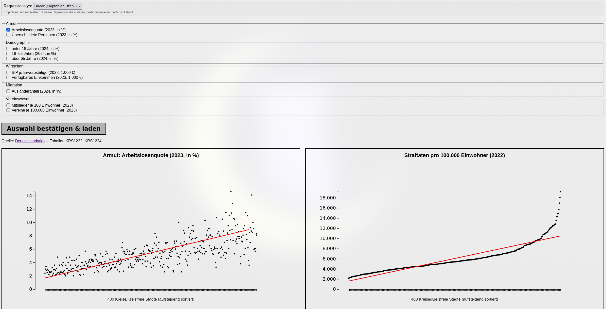

# Crime Statistics Germany Generator

> [!IMPORTANT]
> This project is still in progress and not considered final yet.

> Authors:
>  Julian Wappler  Juan Rojas
> 
## About the Project
This project presents an interactive data atlas for comparing crime rates 
and socioeconomic indicators across German districts. 
It focuses on exploring possible relationships between 
regional crime statistics and factors such as unemployment, 
age distribution, and social infrastructure.

The goal of the project is to make complex regional data easier to understand through visual analysis and comparison.

## Visualizing the Relationship Between Unemployment and Crime

## Features
- Interactive crime statistics visualization for German districts
- Comparison of crime rates with selected socioeconomic indicators
- Scatterplot-based analysis of relationships between variables
- Selectable data categories for customized exploration
- Trend line for identifying possible statistical patterns
- Regional overview of differences between districts

## Tech Stack

| Technology / Library | Purpose |
|----------------------|---------|
| HTML | Structure of the static web page |
| CSS | Styling and responsive layout |
| Vanilla JavaScript | Application logic and interaction handling |
| D3.js | Creating interactive data visualizations |
| d3-regression | Displaying regression and trend lines |
| Comunica | Running SPARQL queries directly in the browser |
| N3.js | Parsing and storing RDF/N-Triples data |
| RDF / N-Triples | Structured data format for districts and indicators |
| SPARQL | Querying crime and socioeconomic data |
| Python HTTP Server | Local testing of the static web application |

## Software Bill of Materials

This project does not currently include a separate Software Bill of Materials because it does not use npm, `node_modules`, a build pipeline, or locally installed package dependencies.

The application is a static web project based on HTML, CSS, and Vanilla JavaScript. External browser libraries such as D3.js, d3-regression, Comunica, and N3.js are included directly in the HTML file via script tags.

The data is stored locally in an N-Triples file and queried client-side using SPARQL.
## Requirements

To build and upload this project, the following tools and hardware are required:

- Visual Studio Code
- PlatformIO extension for Visual Studio Code
- AVR toolchain
- USBasp programmer
- ATmega48 microcontroller

## Requirements

To run this project locally, the following requirements are needed:

- A modern web browser
- Python 3 for starting a local development server
- An internet connection to load the external browser libraries
- The local `daten_indikatoren.nt` data file

No npm installation, build process, or `node_modules` folder is required because the project runs as a static web application.

Start the local server with:

bash
python3 -m http.server 8000

### Compile & Upload

The source code is translated into a .hex file for the ATmega48:

#powershell
pio run -e ATmega48

The compiled program is transferred to the microcontroller:

#powershell
pio run -e ATmega48 -t upload

